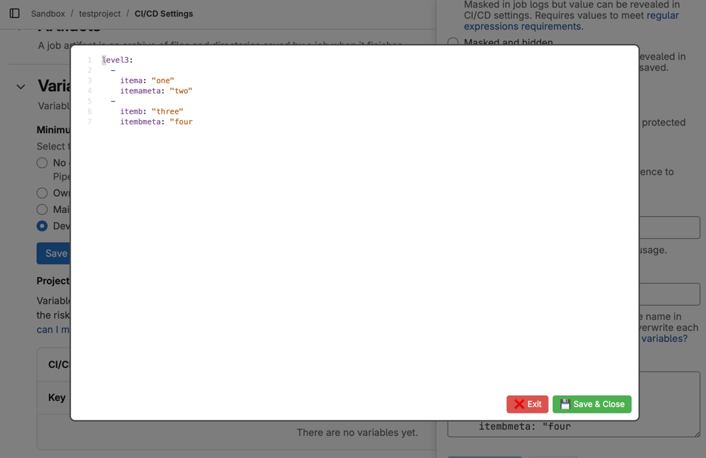

# GitLab CI/CD Variables Editor Bookmarklet

A simple JavaScript bookmarklet for editing GitLab CI/CD variables via a popup with syntax highlighting and better editing capabilities.



## Features

- Opens a popup editor with CodeMirror for editing GitLab CI/CD variables
- Syntax highlighting for YAML content
- Keyboard shortcuts (Escape to close)
- Save and close functionality

## Usage

1. Create a new bookmark in your browser
2. Set any name you want (e.g., "GitLab CI/CD Editor")
3. Copy the entire content from `build/bookmarklet.txt` and paste it as the URL/location of the bookmark
4. When viewing a GitLab CI/CD variable, click the bookmark to open the enhanced editor

## Development

### Project Structure

- `src/bookmarklet.js` - The source JavaScript code

### Build Process

The build process consists of two steps:
1. Minify the JavaScript source code using UglifyJS
2. URL-encode the minified code and prepend with `javascript:` to create the bookmarklet

To build the project:

```bash
npm run build
```

This will generate both the minified JavaScript file (`build/bookmarklet.min.js`) and the URL-encoded bookmarklet file (`build/bookmarklet.txt`).
